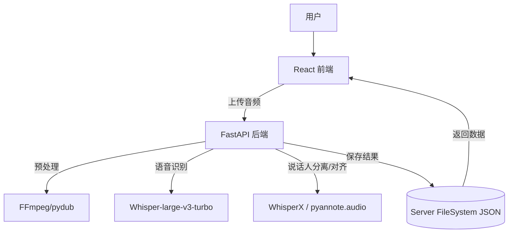

## Product Overview

创建一个基于 Web 的语音识别应用，采用前后端分离架构。前端使用 Vite + React 构建，后端使用 Python FastAPI 部署本地 Whisper-large-v3-turbo 模型。应用集成了 WhisperX 技术以实现说话人识别（Diarization）和精确的字级时间戳对齐。所有识别结果将按照指定的 demo.json 格式保存至服务器，支持完整的本地化部署，不依赖任何云端 API 服务。

## Core Features

- **音频上传与处理**：支持上传常见音频格式（WAV, MP3, M4A），前端实时显示上传进度。
- **语音识别**：调用后端 Whisper-large-v3-turbo 模型进行高精度转录，支持多语言识别。
- **说话人识别**：利用 WhisperX 分离不同说话人，自动标注说话人 ID（如 SPEAKER_00, SPEAKER_01）。
- **精确时间戳**：为每个单词或句子提供精确的起止时间。
- **结果展示与导出**：以分句形式展示识别文本，高亮说话人，点击句子跳转至对应音频时间点；支持 JSON 格式结果下载。
- **任务状态管理**：实时显示识别任务状态（处理中、完成、失败）。

## Tech Stack

- **前端**：React 18 + TypeScript + Vite
- **UI 组件库**：shadcn/ui (基于 Radix UI 和 Tailwind CSS)
- **后端**：Python 3.10 + FastAPI + Uvicorn
- **AI 模型**：OpenAI Whisper-large-v3-turbo (Transformers / faster-whisper)
- **说话人识别**：WhisperX (含 pyannote.audio)
- **音频处理**：ffmpeg, pydub
- **通信协议**：RESTful API + WebSocket (可选，用于实时进度推送)

## Tech Architecture

### System Architecture

系统采用典型的前后端分离架构。前端 React 应用负责用户交互和结果可视化，通过 HTTP API 与 FastAPI 后端通信。后端负责音频预处理、模型推理及结果格式化，并通过文件系统存储 JSON 结果。



### Module Division

- **Frontend Modules**:
- `AudioUploader`: 处理文件选择与上传逻辑。
- `TaskMonitor`: 轮询或监听后端任务状态。
- `TranscriptViewer`: 展示识别文本、说话人标签及时间戳。
- `AudioPlayer`: 集成波形展示与点击跳转功能。
- **Backend Modules**:
- `api/routes`: 定义上传、查询、下载等 API 端点。
- `services/asr_service`: 封装 Whisper 模型调用逻辑。
- `services/diarization_service`: 封装 WhisperX 调用逻辑。
- `models`: 定义数据模型（Pydantic schemas）。
- `utils`: 音频处理工具（格式转换、哈希计算）。

### Data Flow

1. **上传流程**：用户选择音频 -> 前端读取文件 -> 发送 POST 请求至后端 -> 后端保存临时文件 -> 返回 task_id。
2. **处理流程**：后端接收任务 -> 转换音频格式 -> 调用 Whisper 转录 -> 调用 WhisperX 分离说话人并对齐 -> 生成 JSON -> 写入磁盘 -> 更新任务状态。
3. **查询流程**：前端轮询任务状态 -> 后端返回状态或 JSON 结果 -> 前端解析并渲染。

## Implementation Details

### Core Directory Structure

```
whisper-asr-webapp/
├── frontend/                 # 前端项目
│   ├── src/
│   │   ├── components/       # UI 组件
│   │   ├── pages/            # 页面
│   │   ├── services/         # API 封装
│   │   ├── hooks/            # 自定义 Hooks
│   │   └── types/            # TS 类型定义
│   └── package.json
├── backend/                  # 后端项目
│   ├── app/
│   │   ├── api/              # 路由
│   │   ├── core/             # 配置
│   │   ├── models/           # 数据模型
│   │   ├── services/         # 业务逻辑
│   │   └── main.py           # 应用入口
│   ├── storage/              # 音频与结果存储
│   ├── requirements.txt
│   └── pyproject.toml
└── README.md
```

### Key Code Structures

**后端 API 响应模型 (Pydantic)**:

```python
from pydantic import BaseModel
from typing import List, Optional

class SentenceSegment(BaseModel):
    id: int
    speaker: str
    text: str
    start: float
    end: float

class ASRResult(BaseModel):
    result_id: str
    text: str
    sentences: List[SentenceSegment]
    speakers: List[str]
    total_duration: float
    audio_hash: str
    filename: str
    timestamp: str
```

**前端服务层示例**:

```typescript
// services/api.ts
export const uploadAudio = async (file: File): Promise<{ taskId: string }> => {
  const formData = new FormData();
  formData.append('file', file);
  const response = await fetch('/api/upload', { method: 'POST', body: formData });
  return response.json();
};

export const getResult = async (taskId: string): Promise<ASRResult> => {
  const response = await fetch(`/api/result/${taskId}`);
  return response.json();
};
```

### Technical Implementation Plan

1. **后端环境搭建**：

- 配置 Python 虚拟环境，安装 FastAPI, faster-whisper, whisperx, torch, ffmpeg。
- 编写 `main.py` 启动服务，配置 CORS。

2. **音频处理模块**：

- 实现 `convert_audio` 函数统一转换为 16kHz 单声道 WAV。
- 实现计算文件 SHA256 哈希以去重。

3. **Whisper 与 WhisperX 集成**：

- 使用 faster-whisper 加载 turbo 模型进行初始转录。
- 调用 WhisperX pipeline 进行对齐和 Diarization。

4. **API 开发**：

- `POST /upload`: 接收文件，保存到 `storage/uploads/`，返回 task_id。
- `GET /status/{task_id}`: 查询处理状态。
- `GET /result/{task_id}`: 返回 JSON 结果。

5. **前端基础构建**：

- 初始化 Vite + React + TS 项目。
- 安装 shadcn/ui 组件（Button, Card, Progress, ScrollArea）。

6. **前端功能实现**：

- 实现上传组件与状态轮询逻辑。
- 实现结果展示页面，渲染说话人和文本。
- 集成简单的 HTML5 Audio Player 或 Howler.js 实现点击跳转。

### Integration Points

- **前后端通信**：使用 JSON 格式，Content-Type 为 `multipart/form-data` (上传) 和 `application/json` (查询)。
- **文件存储**：后端 `storage/` 目录分为 `uploads/` (原始音频) 和 `results/` (JSON 结果)。
- **模型路径**：支持通过环境变量配置模型下载缓存路径。

## Design Style

采用 "Glassmorphism" (毛玻璃) 风格结合极简主义设计，营造现代、科技感的视觉体验。界面以深色为主调，配合半透明面板和细腻的边框高光。交互上强调流畅的微动画，如按钮悬停的光泽流动、进度条的平滑加载以及切换结果时的淡入淡出。布局响应式适配桌面端，左侧为控制/上传区，右侧为沉浸式的识别结果展示区。

## Agent Extensions

### SubAgent

- **code-explorer**
- Purpose: 在项目初始化或需要分析现有代码结构（如 demo.json 格式）时，用于遍历文件系统和搜索特定代码模式。
- Expected outcome: 准确识别项目结构或关键文件位置，确保代码修改或新增符合现有逻辑。