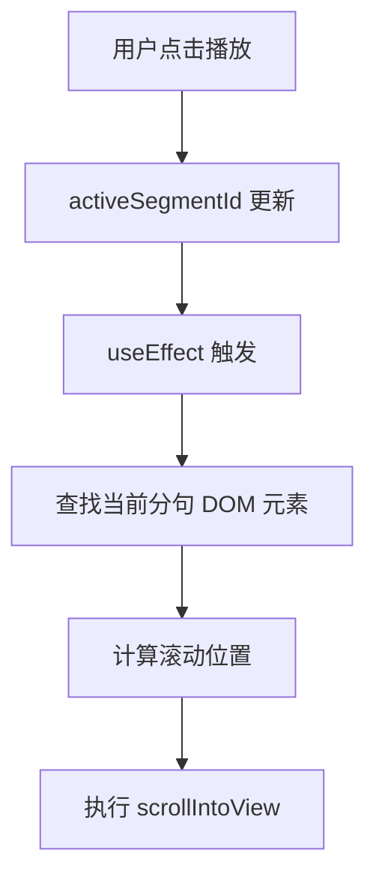

## 产品概述

在播放新分句时实现分句列表的自动滚动功能，确保当前播放的分句始终显示在可视区域内。

## 核心功能

- 为 ScrollArea 组件添加 ref 引用
- 监听 activeSegmentId 的变化
- 在分句切换时自动滚动列表，将当前分句定位到可视区域
- 保持平滑的滚动动画效果

## 技术栈

- 前端框架: React
- UI 组件库: Radix UI ScrollArea (基于现有项目)

## 技术架构

### 系统架构

- 组件层级: ResultViewer → ScrollArea → 分句列表项
- 状态管理: 使用 activeSegmentId 跟踪当前播放分句
- 滚动控制: 通过 useEffect 监听 activeSegmentId 变化触发滚动

### 模块划分

- **ResultViewer 组件**: 主容器，管理播放状态和分句列表渲染
- **ScrollArea 组件**: 滚动容器，提供滚动区域和滚动方法
- **分句项组件**: 单个分句的显示单元

### 数据流



## 实现细节

### 关键代码结构

**Ref 引用**: 使用 ref 获取 ScrollArea 的内部视口和当前分句元素的引用。

```typescript
const scrollAreaRef = useRef<HTMLDivElement>(null);
const segmentRefs = useRef<Map<string, HTMLDivElement>>(new Map());
```

**滚动逻辑**: 监听 activeSegmentId 变化，执行滚动操作。

```typescript
useEffect(() => {
  const element = segmentRefs.current.get(activeSegmentId);
  if (element && scrollAreaRef.current) {
    element.scrollIntoView({ behavior: 'smooth', block: 'center' });
  }
}, [activeSegmentId]);
```

### 技术实现方案

1. **问题陈述**: 需要在播放新分句时自动滚动列表，使当前分句可见。
2. **解决方案**: 使用 React ref 存储每个分句的 DOM 引用，在 activeSegmentId 变化时调用 scrollIntoView API。
3. **关键技术**: useRef、useEffect、scrollIntoView。
4. **实现步骤**:

- 为 ScrollArea 添加 ref
- 为每个分句项添加 ref 并存储到 Map 中
- 在 useEffect 中监听 activeSegmentId 变化
- 获取当前分句元素并执行滚动

5. **测试策略**: 手动测试不同位置的分句切换，验证滚动是否平滑且位置正确。